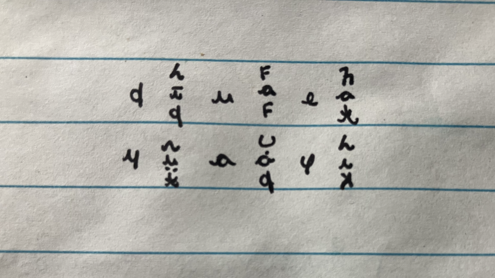

# Script

We are now squarely outside of auxlang territory. I would like to devise a unique script, but mostly for stylistic and worldbuilding reasons. 

This is the way I envision it: a script that conveys **both sound and meaning**, and where each concept is exactly **three letters long**, and has **only 21 unique letters**.

*How is that possible?* You may wonder...
Oravia's unique structure makes it possible!

## The structure

I envision it like this:

First letter -> the domain  
Second letter -> the cluster and subcluster  
Third letter -> sound clue  

So essentially the first two "letters" are giving you the position of the word within the system, and the third letter gives you a sound clue. Instead of reading aloud the sounds, it's kind of like finding a word in a library catalog organized by topic.

I will give examples with latin letters, but imagine they are other letters or symbols instead!   
Before you proceed, a note: this explanation will make much more sense if you already know some Oravia!

## Example: first two letters
Okay, let's suppose you want to write **moaria**, or apple.

The first letter is the domain. The letter **m** (imagine some symbol here) is the domain of biology, with the clusters mo, ma, mu, and mi. So you write down *m*.

Next, you have to indicate the cluster, which is **mo**. If you think about the order mo, ma, mi, mu (say, the order they are presented in the course), *mo* is cluster 1. Domains have between 1-4 clusters, so we need 4 letters here that indicate the numbers 1, 2, 3, and 4. Say, in a latin-like script, the domain is a consonant and the cluster would be a vowel like o, a, i, e, or something. 

Next, you indicate the **moa** subcluster, which is the subcluster 1. Each cluster has between 0-3 subclusters, so we would need here 4 accessories that indicate 0, 1, 2, 3. Say, in a latin-like script, it might be something like one dot above, two dots below, an umlaut, a tilde, or something. This accessory goes on the second letter (like the vowel) to show the subcluster.

## Example: third letter

So, it would work something like this:

**mö** (imagine *m* is a symbol for the domain, *o* is another symbol that indicates cluster 1, and the umlaut is the accessory that indicates subcluster 1). This means *moa*. But now we need to know which *moa* word (moanih, moale, moaria?).

We give it a sound clue! Recall each domain has an associated sound, because that's how Oravia works. For example, the *biology domain* symbol has an *m* sound because that's what these clusters sound like. For the third letter, we would use just the sound, not the meaning. 

For *moaria*, we want an *r* sound clue, so the third letter/symbol is the same as the *r* / institutions domain (ro, ra, rai).

So moaria would be like:

```
mör (again, imagine these are some symbols) = moa + r = moaria / apple 
```

These might be the other *moa* words:

```
möl = moa + l = moalen / banana (third letter *nature* domain le, li, lu)
mön = moa + n = moanih / berry (third letter *function words* domain no, ne)
möw = moa + w = mowena / lemon (third letter *geography* domain wi, wa)
```

Then the prepositions, pronouns, etc, can be expressed with only one letter, based on domain sound, as in:

n = nim, r = run, d = de, s = su, etc

This is an example of what this would be like:

{ width="400" }

And this is vertical style. This has the advantage of making the sentence structure super clear and easy to parse:

{ width="400" }

Vertical style could also be a full symbol for each word, kinda like Maya script. In this option, instead of having three letters/symbols following each other vertically or horizontally, they would be integrated into one symbol with three components. 

## Conclusion

*These examples are a test I made to see how this would work*. I like that I based the letters on logographic symbols from around the world (proto-brahmi, chinese bone oracle, and egyptian hieratic) with clear derivation (for example, the nature/l domain letter looks like a tree). But, I am not sure the letters I created are the right aesthetic. **We need someone to create actual letters/symbols for Oravia if they so feel called :)**

To sum it up, words would be composed of three letters (or one symbol with three components): domain, cluster + subcluster, sound. 

I promise it just seems more confusing now because we don't have the actual letters/symbols. I think merging meaning and sound, and having each word be only three letters long, would be an interesting, unique design for a script. And a perfect fit for Oravia!

---

## Get Involved

Interested in contributing to Oravia's development? I'm always looking for beta testers and feedback!

**Contact:** 

---

[Start Learning Oravia →](../course/lesson00.md){ .md-button .md-button--primary }
